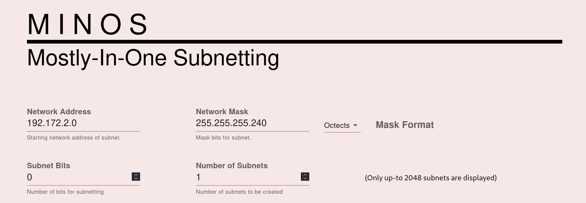
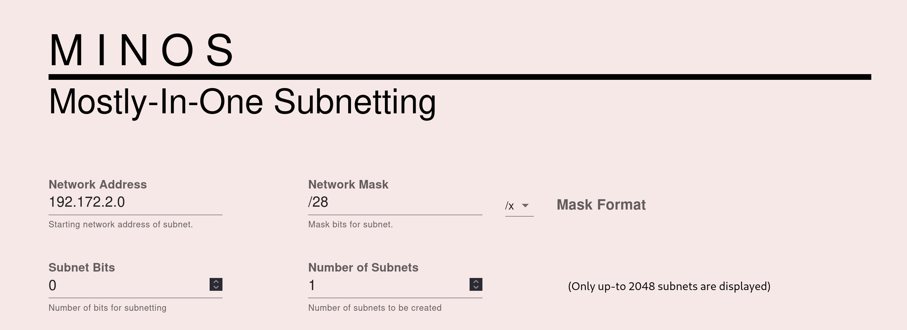
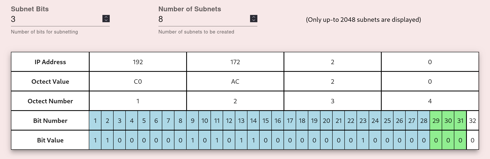
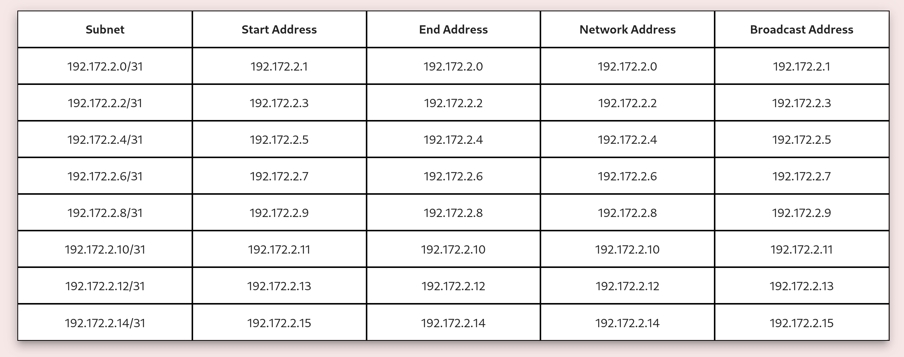

## MINOS
### Mostly In-One Subnetting
Minos is a simple tool meant to facilitate the process of subnetting a network. 
With an IPv4 network addres and a mask, Minos is capable of dividing the network 
address range into the desired amount of subnets. The mask can be provided in either the
octet format (ex. 255.255.255.0) or in CIDR notation (ex \24).

Minos provides a visual repersentation of the bits used when applying a network mask 
and when creating new subnets. 

Minos also provides the first and last host address, as well as the broadcast address of each subnet.

